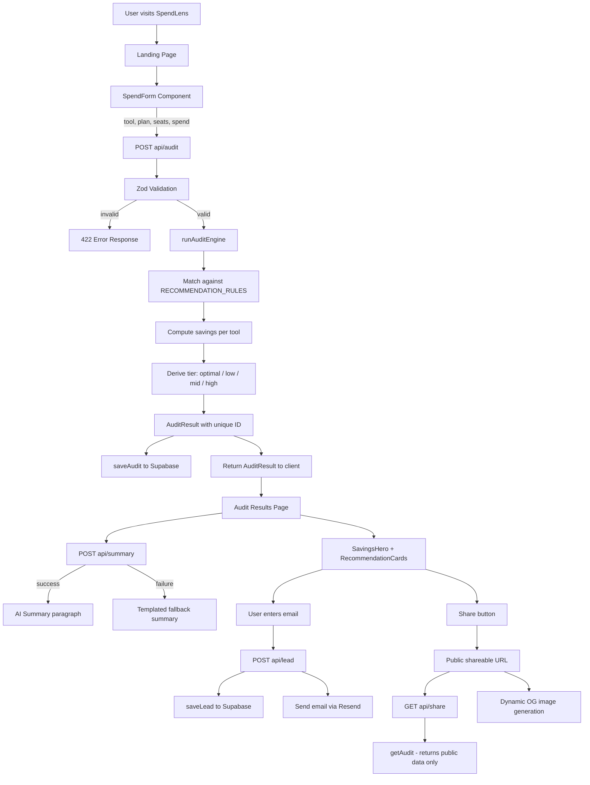

# ARCHITECTURE.md

## System Diagram

---

## Data Flow: Input → Audit Result

1. **User fills SpendForm** — selects tools, plans, seat counts, enters actual monthly spend, sets team size and use case. Form state is persisted in `localStorage` so refreshing doesn't lose progress.

2. **POST /api/audit** — request body is validated with Zod (`AuditInputSchema`). Invalid requests get 422. Rate limit is checked (10 requests/IP/hour) — exceeded requests get 429.

3. **runAuditEngine(input)** — pure function in `lib/audit-engine.ts`. For each tool in the input:
   - Looks up matching rules in `RECOMMENDATION_RULES` (`data/recommendations.ts`)
   - Runs the rule's condition function — `(seats, teamSize, useCase, monthlySpend) => boolean`
   - If a rule fires: computes savings via the rule's formula, sets action and reason
   - If no rule fires: checks if user is overpaying vs list price
   - If neither: returns `action: "keep"` with a reason
   - Aggregates total savings, computes `savingsPercentage`, derives `tier`

4. **Supabase write** — `saveAudit()` writes two copies: `data` (full audit including input) and `public_data` (stripped of email, company — safe for public URLs). Write is blocking — API waits to ensure audit exists before client navigates to results page.

5. **Client renders results** — React state updates, results page animates in. `AIInsightCard` fetches `/api/summary` in the background.

6. **Lead capture** — after user enters email, `/api/lead` saves to `leads` table and triggers Resend email with the full breakdown.

7. **Share URL** — `/audit/[id]` fetches `public_data` only from Supabase. No PII exposed. `opengraph-image.tsx` generates a dynamic PNG with the savings number for Twitter/LinkedIn previews.

---

## Why This Stack

| Layer | Choice | Reason |
|---|---|---|
| Framework | Next.js 14 App Router | UI + API routes + SSR + dynamic OG images — one framework, one deploy |
| Language | TypeScript | Financial logic needs compile-time type safety — wrong types = wrong savings numbers |
| Styling | Tailwind CSS | Rapid iteration, dark-mode-only palette trivial to maintain via CSS variables |
| Database | Supabase (Postgres) | Hosted Postgres + typed JS client + leads dashboard in 10 minutes. Two tables — no ORM needed |
| Email | Resend | 3000 free emails/month, simple API, better deliverability than raw SMTP |
| AI | Anthropic claude-3-5-haiku | Fast and cheap for a 100-word summary. Graceful fallback means page never breaks |
| Testing | Vitest | ESM-native, works with TypeScript path aliases without extra config |
| Deployment | Vercel | Zero-config Next.js, edge functions, automatic preview deployments |

---

## What I'd Change at 10k Audits/Day

**Rate limiting → Upstash Redis**
Current in-memory rate limiter resets on cold start and doesn't distribute across multiple Vercel instances. Upstash Redis is a one-day swap — same API, works across all instances.

**Supabase → PgBouncer connection pooling**
At 10k audits/day (~7 req/minute average, spiky to 50+/minute), direct Postgres connections become a bottleneck. Supabase's built-in PgBouncer handles this — enable in the dashboard, no code changes.

**Audit persistence → async retry queue**
Currently the DB write blocks the API response. At high volume, use a queue (Upstash QStash or Inngest) to decouple write from response — respond immediately, write in the background with automatic retries on failure.

**AI summary → cached in DB**
The `/api/summary` route calls Anthropic on every page load. At scale, generate the summary once and cache it in the `audits` table alongside the audit. Serve from DB on subsequent loads — already partially set up with the `aiSummary` field.

**Analytics → PostHog**
Add event tracking: form start rate, form completion rate, audit-to-lead conversion, which tools appear most, which recommendations fire most. This data improves the recommendation engine over time and tells Credex which tools to stock credits for.
