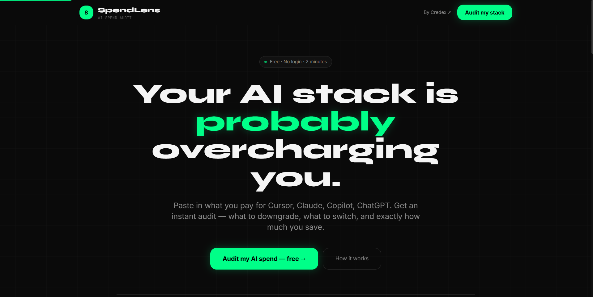
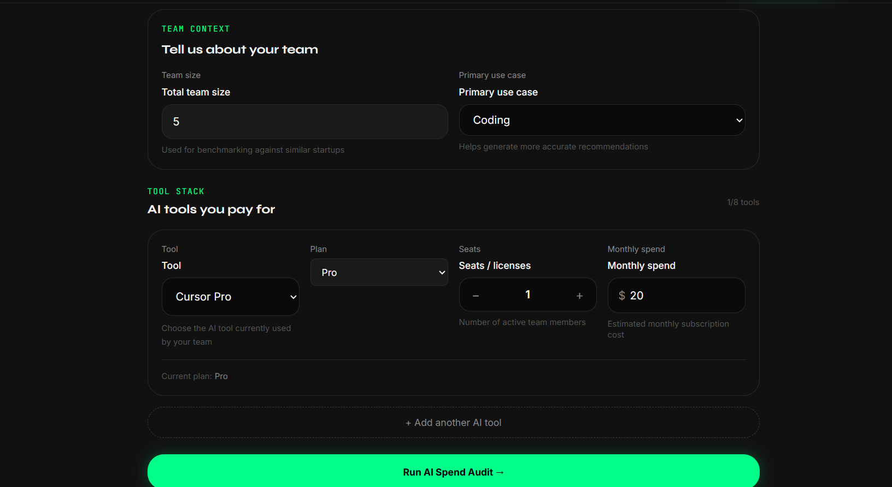
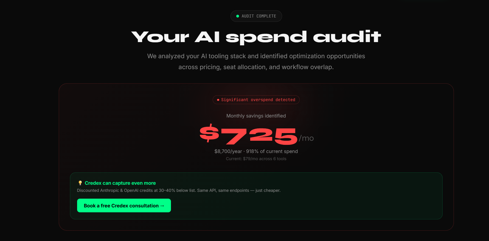
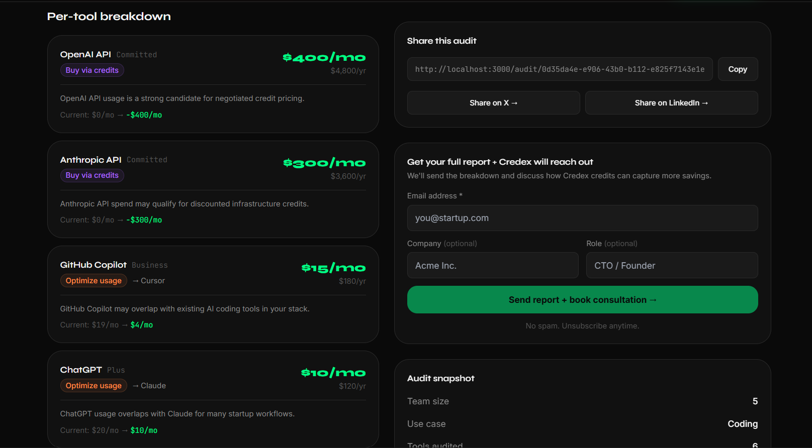
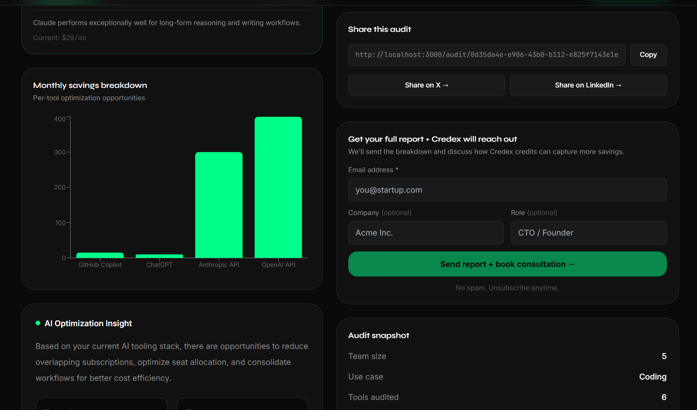
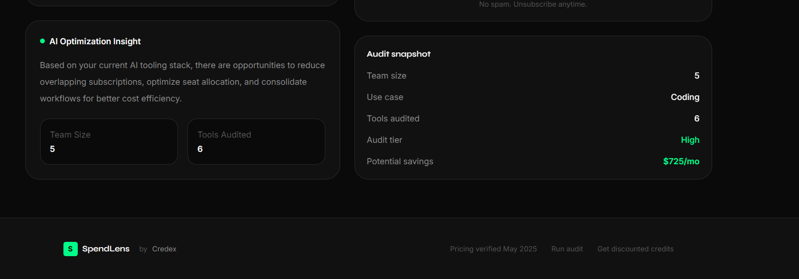

# SpendLens AI 🔍

**Free AI spend audit for startups.** Find out where you're overpaying on Cursor, Claude, ChatGPT, Copilot, and more — in 2 minutes, no login required.

🔗 **Live demo:** https://spend-lens-ai-uah9.vercel.app  
📦 **Repo:** https://github.com/sahilsingh78/SpendLens-AI  
🏢 **Built for:** Credex Web Dev Intern Assignment — Round 1

---

## What It Does

A cold visitor lands on the page, enters what AI tools they pay for (tool, plan, seats, monthly spend), their team size and use case — and gets an instant audit: what to downgrade, what to switch, and the total monthly + annual savings. Email is captured after the result is shown, never before. Every audit gets a shareable public URL with proper Open Graph image previews.

---

## Screenshots

### Landing Page


### Spend Audit Form


### Audit Results Dashboard



### Shareable Public Report



---

## Quick Start

```bash
git clone https://github.com/sahilsingh78/SpendLens-AI.git
cd SpendLens-AI
npm install
cp .env.example .env.local
# Fill in your env vars (see below)
npm run dev
```

Open http://localhost:3000

---

## Environment Variables

Create a `.env.local` file in the root:

```env
NEXT_PUBLIC_SUPABASE_URL=your_supabase_project_url
NEXT_PUBLIC_SUPABASE_ANON_KEY=your_supabase_anon_key
SUPABASE_SERVICE_ROLE_KEY=your_supabase_service_role_key
ANTHROPIC_API_KEY=your_anthropic_api_key
RESEND_API_KEY=your_resend_api_key
NEXT_PUBLIC_APP_URL=http://localhost:3000
```

### Supabase Table Setup

Run this SQL in your Supabase SQL Editor:

```sql
create table audits (
  id text primary key,
  data jsonb not null,
  public_data jsonb not null,
  created_at timestamp with time zone default now()
);

create table leads (
  id uuid default gen_random_uuid() primary key,
  email text not null,
  company_name text,
  role text,
  team_size integer,
  audit_id text references audits(id),
  monthly_savings numeric,
  created_at timestamp with time zone default now()
);
```

---

## Run Tests

```bash
npm test
```

All 28 tests across 5 files. Covers audit engine, pricing logic, recommendation rules, Zod validation, and rate limiting.

---

## Deploy

Push to GitHub — Vercel auto-deploys from `main`. Add all env vars in Vercel dashboard → Settings → Environment Variables.

---

## Complete Project Structure

```
spendlens-ai/
│
├── app/
│   ├── api/
│   │   ├── audit/
│   │   │   └── route.ts              # POST — validates, runs audit engine, saves to Supabase
│   │   ├── lead/
│   │   │   └── route.ts              # POST — saves lead, sends Resend email
│   │   ├── summary/
│   │   │   └── route.ts              # POST — Anthropic API call, returns AI summary
│   │   └── share/
│   │       └── route.ts              # GET — fetches public audit (no PII)
│   │
│   ├── audit/
│   │   └── [id]/
│   │       ├── page.tsx              # Server component — fetches audit, renders results
│   │       ├── AuditResultsClient.tsx # Client — interactive results page
│   │       ├── loading.tsx           # Suspense loading skeleton
│   │       └── opengraph-image.tsx   # Dynamic OG image with savings number
│   │
│   ├── favicon.ico
│   ├── globals.css                   # CSS variables, base styles, animations
│   ├── layout.tsx                    # Root layout — metadata, OG tags, skip link
│   ├── loading.tsx                   # Root loading spinner
│   ├── not-found.tsx                 # 404 page
│   └── page.tsx                      # Homepage — landing sections + form + results
│
├── components/
│   ├── audit/
│   │   ├── AuditBreakdown.tsx        # Sorts and renders recommendation cards + charts
│   │   ├── AuditCard.tsx             # Compact audit summary card
│   │   ├── RecommendationCard.tsx    # Per-tool: action badge, savings, reason string
│   │   ├── SavingsHero.tsx           # Big savings number + Credex CTA for high savings
│   │   ├── ShareAudit.tsx            # Copy link + Twitter/LinkedIn share buttons
│   │   └── AIInsightCard.tsx         # Fetches and displays AI-generated summary
│   │
│   ├── charts/
│   │   ├── SavingsChart.tsx          # Bar chart — monthly savings by tool
│   │   └── SpendPieChart.tsx         # Pie chart — current spend breakdown
│   │
│   ├── form/
│   │   ├── SpendForm.tsx             # Main form — tool rows, persist via localStorage
│   │   ├── ToolSelector.tsx          # Tool dropdown
│   │   ├── PricingInput.tsx          # $ prefixed number input
│   │   ├── TeamSizeInput.tsx         # Team size input
│   │   ├── SeatCounter.tsx           # +/- seat counter
│   │   └── UseCaseSelect.tsx         # Use case dropdown
│   │
│   ├── landing/
│   │   ├── Hero.tsx                  # Headline, CTA buttons, ticker
│   │   ├── Features.tsx              # 6 feature cards
│   │   ├── Stats.tsx                 # 4 stat blocks
│   │   ├── FAQ.tsx                   # Accordion FAQ — 5 questions
│   │   ├── CTA.tsx                   # Bottom CTA section
│   │   └── Footer.tsx                # Footer with Credex link
│   │
│   ├── lead/
│   │   ├── LeadCaptureForm.tsx       # Email form with honeypot bot protection
│   │   ├── SuccessModal.tsx          # Post-submit success modal
│   │   └── EmailConfirmation.tsx     # Inline confirmation after email sent
│   │
│   └── shared/
│       ├── Navbar.tsx                # Sticky nav with logo + CTA
│       ├── ThemeToggle.tsx           # Dark-mode only stub
│       ├── Loader.tsx                # Spinner, 3 sizes
│       ├── ErrorState.tsx            # Error with retry
│       └── EmptyState.tsx            # Empty state with action slot
│
├── data/
│   ├── pricing-data.ts               # 8 tools, all plans, official prices
│   ├── benchmark-data.ts             # Avg AI spend by company stage
│   └── recommendations.ts            # Rule table → condition → savings → reason
│
├── hooks/
│   ├── useAudit.ts                   # Audit API call state machine
│   ├── useLocalStorage.ts            # Type-safe localStorage with SSR safety
│   └── useTheme.ts                   # Dark-mode stub
│
├── lib/
│   ├── ai-summary.ts                 # Anthropic API + fallback template
│   ├── audit-engine.ts               # Core: input → AuditResult
│   ├── constants.ts                  # Thresholds, app config, URLs
│   ├── helpers.ts                    # cn(), formatCurrencyFull(), getTierColor()
│   ├── pricing.ts                    # Price lookups, overpay detection
│   ├── rate-limit.ts                 # In-memory IP rate limiter
│   ├── resend.ts                     # Email HTML + Resend client
│   ├── storage.ts                    # Local audit history
│   ├── supabase.ts                   # DB client + saveAudit/getAudit/saveLead
│   ├── types.ts                      # All TypeScript interfaces
│   └── validations.ts                # Zod schemas for API validation
│
├── services/
│   ├── audit.service.ts              # Client-side audit fetch
│   ├── email.service.ts              # Client-side email utilities
│   ├── lead.service.ts               # Client-side lead submission
│   └── summary.service.ts            # Client-side AI summary fetch
│
├── styles/
│   └── animations.css                # Extra keyframes (bounceIn, slideUp etc.)
│
├── tests/
│   ├── api.test.ts                   # Rate limiter + audit shape (5 tests)
│   ├── audit-engine.test.ts          # Core engine logic (8 tests)
│   ├── pricing.test.ts               # Price lookups + overpay (5 tests)
│   ├── recommendation.test.ts        # Rule conditions + formulas (5 tests)
│   └── validation.test.ts            # Zod schemas (5 tests)
│
├── public/
│   ├── icons/
│   ├── images/
│   │   └── og-image.png
│   └── logos/
│
├── .github/
│   └── workflows/
│       └── ci.yml                    # Lint + typecheck + test on push to main
│
├── .env.example
├── .env.local                        # gitignored
├── .gitignore
├── components.json                   # shadcn/ui config
├── eslint.config.mjs
├── next.config.ts
├── package.json
├── postcss.config.mjs
├── tailwind.config.ts
├── tsconfig.json
│
├── README.md
├── ARCHITECTURE.md
├── DEVLOG.md
├── REFLECTION.md
├── TESTS.md
├── PRICING_DATA.md
├── PROMPTS.md
├── GTM.md
├── ECONOMICS.md
├── USER_INTERVIEWS.md
├── LANDING_COPY.md
├── METRICS.md
│
└── LICENSE
```

---

## Decisions

**1. Hardcoded rules for audit logic, not AI**
The audit engine uses a deterministic rule table in `data/recommendations.ts`. Every rule has a condition function, a savings formula, and a reason string. AI is used only for the 100-word narrative summary — not the math. Financial recommendations must be auditable. If Claude hallucinated a savings number, that's a real problem for a real founder. The assignment says "knowing when not to use AI is part of the test."

**2. Supabase over Prisma + Render Postgres**
Originally planned Prisma. Switched on Day 2. Two tables, simple inserts and selects — Prisma's migration management is overkill. Supabase gives hosted Postgres, a typed JS client, and a leads dashboard in 10 minutes. Time saved went into recommendation engine depth and UI polish.

**3. In-memory rate limiting over Redis**
The rate limiter uses a Node.js `Map`. Resets on cold start and doesn't distribute across multiple instances — documented in `lib/rate-limit.ts`. Acceptable for this scale. At 10k audits/day across multiple Vercel instances, swap to Upstash Redis in one day.

**4. Dark mode only**
Eliminates: contrast ratios for both themes, theme switching bugs, CSS variable duplication. The audience (developers and technical founders) is overwhelmingly dark-mode. Trade-off: accessibility for light-mode users. Documented as a future improvement.

**5. Email captured after results, always**
Lead capture form appears below the audit results, never before. Gating value behind email destroys trust with developers. Post-value conversion rate is higher — a user who just saw $400/month in savings is far more motivated to share their email than a cold visitor.

---

## Tech Stack

| Layer | Technology | Why |
|---|---|---|
| Framework | Next.js 14 App Router | UI + API routes + OG images, one framework |
| Language | TypeScript | Type safety on financial logic |
| Styling | Tailwind CSS | Dark mode, rapid iteration |
| Database | Supabase (Postgres) | Hosted, typed client, lead dashboard |
| Email | Resend | 3k free/month, clean API |
| AI | Anthropic claude-3-5-haiku | Fast, cheap, right for 100-word summary |
| Testing | Vitest | ESM-native, works with TS path aliases |
| Deployment | Vercel | Zero-config Next.js |

---

## Supported Tools

| Tool | Plans Supported |
|---|---|
| Cursor | Hobby / Pro / Business / Enterprise |
| GitHub Copilot | Individual / Business / Enterprise |
| Claude | Free / Pro / Max 5x / Max 20x / Team / Enterprise |
| ChatGPT | Free / Plus / Team / Enterprise / API |
| Anthropic API | Pay-as-you-go / Committed use |
| OpenAI API | Pay-as-you-go / Committed use |
| Gemini | Free / Advanced / Business / Enterprise / API |
| Windsurf | Free / Pro / Teams / Enterprise |

---

## Author

**Sahil Singh**  
GitHub: [@sahilsingh78](https://github.com/sahilsingh78)  
Submission for: Credex Web Dev Intern — Round 1, May 2026

---

## License

MIT License

Copyright (c) 2026 Sahil Singh

Permission is hereby granted, free of charge, to any person obtaining a copy of this software and associated documentation files (the "Software"), to deal in the Software without restriction, including without limitation the rights to use, copy, modify, merge, publish, distribute, sublicense, and/or sell copies of the Software, and to permit persons to whom the Software is furnished to do so, subject to the following conditions:

The above copyright notice and this permission notice shall be included in all copies or substantial portions of the Software.

THE SOFTWARE IS PROVIDED "AS IS", WITHOUT WARRANTY OF ANY KIND, EXPRESS OR IMPLIED, INCLUDING BUT NOT LIMITED TO THE WARRANTIES OF MERCHANTABILITY, FITNESS FOR A PARTICULAR PURPOSE AND NONINFRINGEMENT. IN NO EVENT SHALL THE AUTHORS OR COPYRIGHT HOLDERS BE LIABLE FOR ANY CLAIM, DAMAGES OR OTHER LIABILITY, WHETHER IN AN ACTION OF CONTRACT, TORT OR OTHERWISE, ARISING FROM, OUT OF OR IN CONNECTION WITH THE SOFTWARE OR THE USE OR OTHER DEALINGS IN THE SOFTWARE.

---

*Pricing data verified May 2026. SpendLens is a free tool by [Credex](https://credex.rocks) — discounted AI credits for startups.*